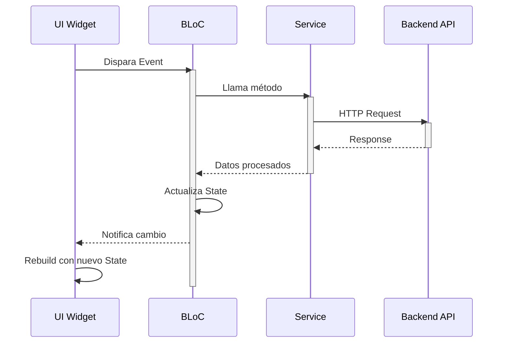
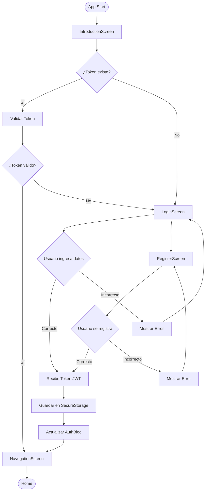
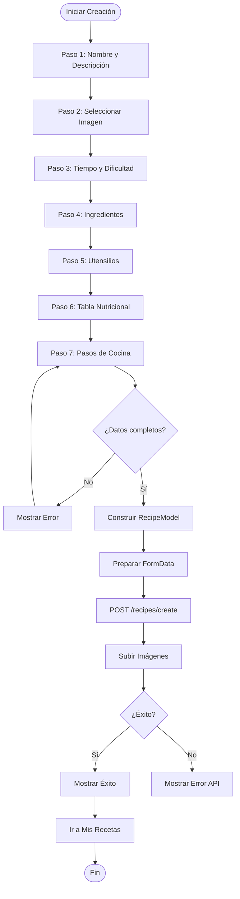
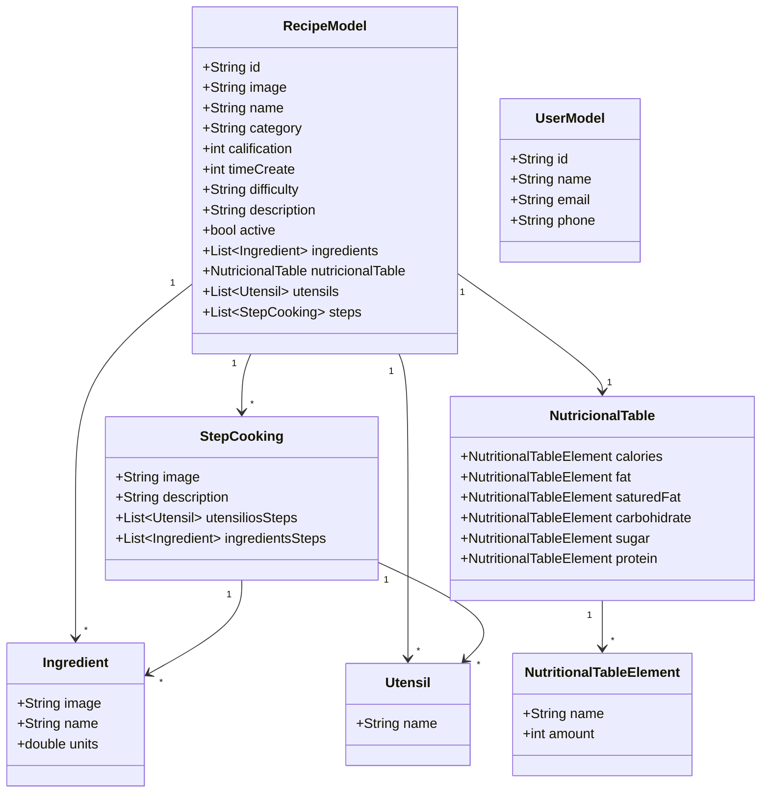
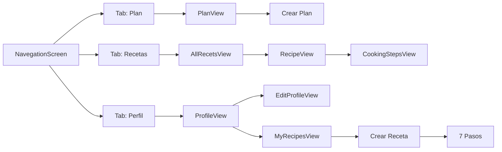
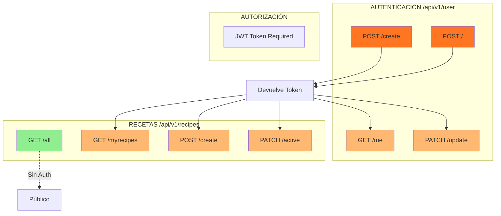

# 📱 PLATOSYPLAN - App de Recetas y Planificación de Comidas

<div align="center">


**Plataforma para gestionar recetas de cocina y planificar comidas semanales**

[Características](#-características-principales) • [Arquitectura](#-arquitectura) • [Instalación](#-instalación) • [Documentación](#-documentación-técnica)

</div>

---


## 🎯 ¿Qué es platosyplan?

**platosyplan** es una aplicación móvil Flutter que funciona como una plataforma completa de gestión de recetas de cocina similar a HelloFresh o Cookpad. Permite a los usuarios descubrir recetas, crear sus propias recetas con ingredientes e información nutricional detallada, y planificar comidas semanales de forma organizada.


### Propósito
- 📖 Explorar recetas con instrucciones paso a paso
- 👨‍🍳 Crear y publicar recetas completas
- 📅 Planificar comidas semanales personalizadas
- 🔒 Gestión de usuario con autenticación segura

---

## ✨ Características Principales

### 1. 🔐 Autenticación Completa
- Registro e inicio de sesión con JWT
- Almacenamiento seguro de tokens (Keychain/EncryptedSharedPreferences)
- Validación automática de sesión
- Gestión y actualización de perfil


### 2. 📚 Gestión de Recetas

#### Ver Recetas
- Catálogo completo de recetas públicas con paginación
- Filtros por categoría, tiempo y dificultad
- Detalle completo: ingredientes, utensilios, tabla nutricional
- Sistema de calificación


#### Mis Recetas
- Lista personal de recetas creadas
- Activar/desactivar visibilidad pública
- Gestión completa (editar, eliminar)


#### Crear Recetas (Proceso de 7 Pasos)
1. **Nombre y descripción** - Información básica
2. **Imagen principal** - Foto desde cámara o galería
3. **Tiempo y dificultad** - Categoría, tiempo de preparación, nivel
4. **Ingredientes** - Lista con cantidades y unidades
5. **Utensilios** - Equipamiento necesario
6. **Tabla nutricional** - 9 valores nutricionales (calorías, grasas, proteínas, etc.)
7. **Pasos de cocina** - Instrucciones detalladas con imágenes


### 3. 🍳 Pasos de Cocina Interactivos
- Carrusel horizontal con navegación swipe
- Timeline de progreso visual
- Ingredientes y utensilios específicos por paso
- Sincronización automática entre vistas


### 4. 📅 Planificación de Comidas
- Selector de número de personas (1-5+)
- Comidas por semana configurables (3, 5, 7, 14, 21)
- Calendario semanal con recetas asignadas
- Vista organizada por días y tipo de comida


### 5. 👤 Gestión de Perfil
- Información del usuario (nombre, email, teléfono)
- Edición de datos personales
- Estadísticas de uso
- Cierre de sesión seguro


---

## 🏗️ Arquitectura

### Patrón: Arquitectura Limpia + BLoC

```
┌─────────────────────────────────┐
│   UI (Screens/Views)            │
└────────────┬────────────────────┘
             ↓
┌─────────────────────────────────┐
│   BLoC (Estado)                 │
│   • AuthBloc                    │
│   • RecipesBloc                 │
│   • PlanBloc                    │
│   • StepsBloc                   │
│   • SlidershowBloc              │
└────────────┬────────────────────┘
             ↓
┌─────────────────────────────────┐
│   Services (Lógica)             │
│   • AuthService                 │
│   • RecipeServices              │
│   • Interceptors                │
└────────────┬────────────────────┘
             ↓
┌─────────────────────────────────┐
│   Backend REST API              │
└─────────────────────────────────┘
```

### Estructura del Proyecto

```
lib/
├── bloc/              # Gestión de estado (BLoC Pattern)
├── models/            # Modelos de datos
├── services/          # Servicios y llamadas API
├── presentation/      # UI (screens y views)
├── components/        # Widgets reutilizables
├── routes/            # Configuración de rutas
├── utils/             # Utilidades
└── main.dart          # Punto de entrada
```

---

## 📊 Diagramas de Arquitectura

### Diagrama de Flujo BLoC Pattern



### Diagrama de Flujo de Autenticación



### Diagrama de Flujo de Creación de Receta



### Diagrama de Modelo de Datos



### Diagrama de Navegación Principal



### Diagrama de Endpoints API



---

## 💻 Stack Tecnológico

### Core
- **Flutter** 3.5.4+ - Framework multiplataforma
- **Dart** - Lenguaje de programación

### Gestión de Estado
- **flutter_bloc** ^8.1.6 - Patrón BLoC
- **bloc** ^8.1.4 - Core BLoC

### Networking
- **dio** ^5.7.0 - Cliente HTTP
- **flutter_dotenv** ^5.2.1 - Variables de entorno

### Seguridad
- **flutter_secure_storage** ^9.2.2 - Almacenamiento encriptado de tokens

### UI y Multimedia
- **flutter_svg** ^2.0.10+1 - Renderizado SVG
- **image_picker** ^1.1.2 - Captura de imágenes

### Utilidades
- **url_launcher** ^6.1.11 - Abrir URLs
- **cupertino_icons** ^1.0.8 - Íconos iOS

---

## 🚀 Instalación

### Requisitos Previos
- Flutter SDK 3.5.4 o superior
- Dart SDK
- Android Studio / Xcode (según plataforma)
- Backend API corriendo (ver [Backend Setup](#backend-setup))

### Pasos de Instalación

1. **Clonar el repositorio**
```bash
git clone <repository-url>
cd platosyplan_app_flutter
```

2. **Instalar dependencias**
```bash
flutter pub get
```

3. **Configurar variables de entorno**

Crear archivo `.env.dev` en la raíz del proyecto:

```env
BACKEND_URL=http://localhost:3000/api/v1
```

Para producción, crear `.env.prod`:

```env
BACKEND_URL=https://api.platosyplan.com/api/v1
```

4. **Ejecutar la aplicación**
```bash
# Desarrollo
flutter run

# Build Android
flutter build apk --release

# Build iOS
flutter build ios --release
```

### Backend Setup

⚠️ **IMPORTANTE**: Esta aplicación requiere un backend REST API corriendo.

El backend debe proporcionar los siguientes endpoints:

**Autenticación** (`/api/v1/user`)
- `POST /create` - Registro
- `POST /` - Login
- `GET /me` - Obtener perfil
- `PATCH /update` - Actualizar usuario

**Recetas** (`/api/v1/recipes`)
- `GET /all` - Obtener todas las recetas
- `GET /myrecipes` - Obtener recetas del usuario
- `POST /create` - Crear receta (multipart/form-data)
- `PATCH /active` - Activar/desactivar receta

---

## 📋 Documentación Técnica

### Modelos de Datos

#### RecipeModel
```dart
{
  "id": "uuid",
  "image": "url",
  "name": "Pasta Carbonara",
  "category": "Almuerzo",
  "calification": 5,
  "time_create": 30,
  "difficulty": "Medio",
  "description": "Descripción...",
  "active": true,
  "ingredients": [
    {"name": "Pasta", "units": 400.0, "image": "url?"}
  ],
  "nutricional_table": {
    "calories": {"name": "Calorías", "amount": 450},
    "fat": {"name": "Grasas", "amount": 18},
    // ... otros valores
  },
  "utensils": [{"name": "Olla grande"}],
  "steps": [
    {
      "image": "url",
      "description": "Instrucciones...",
      "utensilios_steps": [],
      "ingredients_steps": []
    }
  ]
}
```

#### UserModel
```dart
{
  "id": "uuid",
  "name": "Juan Pérez",
  "email": "juan@email.com",
  "phone": "573001234567",
  "CreatedAt": "2024-01-08T10:30:00Z",
  "UpdatedAt": "2024-01-08T10:30:00Z"
}
```

### BLoCs Principales

#### AuthBloc
- **Responsabilidad**: Autenticación y gestión de usuario
- **Métodos**: `registerNewUser()`, `loginSesion()`, `loadCredentials()`, `updateUser()`

#### RecipesBloc
- **Responsabilidad**: Gestión completa de recetas
- **Métodos**: `getAllRecipes()`, `getMyRecipes()`, `createRecipe()`, `changeActiveRecipe()`
- **Estado**: Almacena recetas y datos de creación (nombre, ingredientes, pasos, etc.)

#### PlanBloc
- **Responsabilidad**: Planificación de comidas
- **Estado**: `peopleActive`, `meelsPerWeek`

#### StepsBloc
- **Responsabilidad**: Pasos de cocina interactivos
- **Especial**: StreamSubscription al SlidershowBloc para sincronización

### Servicios

#### AuthService
- Gestión de tokens JWT
- Almacenamiento seguro (FlutterSecureStorage)
- Timeout: 5 segundos
- Auto-logout en caso de token inválido

#### RecipeServices
- Cliente Dio con AuthorizationInterceptor
- Soporte multipart/form-data para imágenes
- Manejo de errores personalizado

### Componentes Reutilizables

**Navegación**
- `ButtonComponent` - Botón principal con loading
- `DrawerComponent` - Menú lateral

**Formularios**
- `TextFormFieldComponent` - Input personalizado
- `CategorySelectorComponent` - Selector de categorías

**Multimedia**
- `SelectImageComponent` - Selector cámara/galería
- `SlideshowComponent` - Carrusel genérico

**Progreso**
- `TimelineVerticalComponent` - Timeline de pasos
- Loading states y animaciones

**Alertas**
- `ShowAlertComponent` - Diálogos personalizados
- `ShowScaffoldMessageComponent` - SnackBars

---

## 🎨 Diseño

### Paleta de Colores
- **Primario**: `#FF7622` (Naranja vibrante)
- **Secundario**: `#FFB872` (Naranja claro)
- **Fondo**: `#FFEBE4` (Melocotón)
- **Scaffold**: `#FFFFFF` (Blanco)

### Material Design 3
- Componentes modernos
- Animaciones fluidas
- Diseño responsivo (breakpoint: 600px)

### Navegación
Bottom Navigation Bar flotante con 3 tabs:
- 🍽️ **Plan** - Planificación de comidas
- 📖 **Recetas** - Catálogo de recetas
- 👤 **Perfil** - Gestión de usuario

---

## 🗺️ Flujo de Navegación

```
Introduction
    ↓
¿Token válido?
    ├─ Sí → Navegation (Home)
    └─ No → Login/Register
              ↓
         Navegation
         ├─ Plan
         ├─ Recetas
         │   ├─ Ver todas
         │   ├─ Mis recetas
         │   ├─ Crear (7 pasos)
         │   └─ Detalle → Pasos de cocina
         └─ Perfil
             ├─ Ver perfil
             └─ Editar perfil
```

### Rutas Definidas

```dart
'introduction'       → IntroductionView
'login'              → LoginView
'register'           → RegisterView
'navegation'         → NavegationScreen (Home)
'profile'            → ProfileView
'editprofile'        → EditProfileView
'myrecipes'          → MyRecipesView
'recipe'             → RecipeView
'allrecets'          → AllRecetsView
'cookingsteps'       → CookingStepsView

// Crear receta (7 pasos)
'nameanddescription' → Paso 1
'selectimagerecipe'  → Paso 2
'timedifficulty'     → Paso 3
'selectedingredients'→ Paso 4
'selectingutensils'  → Paso 5
'nutritionaltable'   → Paso 6
'sevencreatesteps'   → Paso 7

// Plan
'selectplan'         → Selección de personas
'selectmeels'        → Selección de comidas/semana
```

---

## 🔒 Seguridad

- **JWT Tokens**: Almacenados de forma segura
  - iOS: Keychain
  - Android: EncryptedSharedPreferences
- **Interceptores**: Agregan automáticamente autorización
- **Validación**: Cliente y servidor side
- **Auto-logout**: En caso de token inválido

---

## 📱 Capturas de Pantalla

### Introducción
- Carrusel de bienvenida con 5 slides SVG
- Verificación automática de sesión

### Autenticación
- Login con email y contraseña
- Registro completo con validaciones

### Navegación Principal
- Bottom Nav Bar flotante y moderno
- 3 secciones principales

### Recetas
- Catálogo completo con tarjetas visuales
- Detalle con toda la información
- Mis recetas con gestión

### Crear Receta
- Proceso guiado en 7 pasos
- Validaciones en cada paso
- Preview antes de crear

### Pasos de Cocina
- Carrusel interactivo
- Timeline de progreso
- Ingredientes por paso

### Planificación
- Selector de personas
- Calendario semanal
- Recetas asignadas

### Perfil
- Información del usuario
- Edición de datos
- Opciones de configuración

---

## 🔮 Mejoras Futuras

### Funcionalidades
- [ ] Sistema de favoritos
- [ ] Calificación y reviews de recetas
- [ ] Búsqueda avanzada con filtros
- [ ] Compartir recetas en redes sociales
- [ ] Lista de compras automática desde plan
- [ ] Notificaciones push
- [ ] Modo offline
- [ ] Soporte multi-idioma
- [ ] Temas claro/oscuro

### Técnicas
- [ ] Caché de imágenes
- [ ] Tests unitarios y de integración
- [ ] CI/CD pipeline
- [ ] Analytics y Crashlytics
- [ ] Deep linking
- [ ] Optimización web

---

## 🛠️ Comandos Útiles

```bash
# Desarrollo
flutter run                      # Ejecutar en debug
flutter run --release            # Ejecutar en release

# Build
flutter build apk --release      # Build Android
flutter build ios --release      # Build iOS
flutter build web                # Build Web

# Mantenimiento
flutter clean                    # Limpiar build
flutter pub get                  # Instalar dependencias
flutter pub upgrade              # Actualizar dependencias

# Testing
flutter test                     # Ejecutar tests
flutter analyze                  # Análisis estático
```

---


<div align="center">

**platosyplan** - Gestión de Recetas y Planificación de Comidas

[](https://flutter.dev)
[](https://bloclibrary.dev)

</div>
